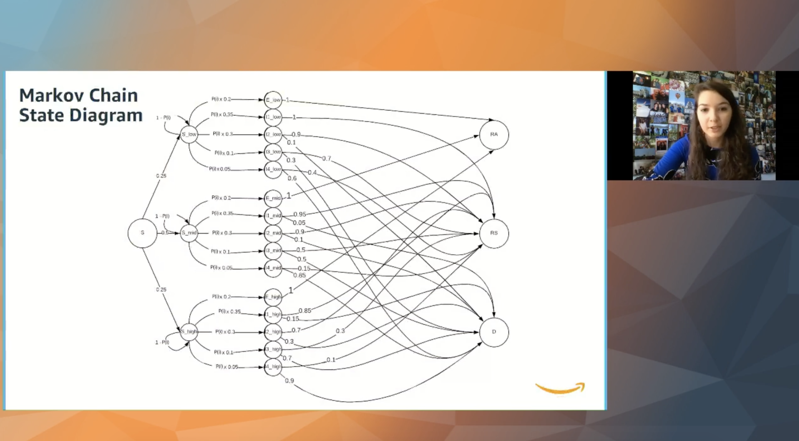

## WiCS Hackathon Win
The Davidson College Women in Computer Science club (WiCS-formerly FiCSIT) sent an all-woman team to the 2018 Hackathon at Davidson College. We ([Sarah Hancock](https://www.linkedin.com/in/sarhancock/), [Natlie Kucher](https://www.linkedin.com/in/natalie-kucher-5b214a122/), [Elein Tsitinidi](https://www.linkedin.com/in/eleni-tsit/), and myself) were awarded “Best Overall Team” award based on both coding skills and presentation/communication skills to explain our project. Our task was to create a product that shared the experience of Davidson College with a designated audience. Our product was a web app with two Python programs on the back end to share the experience of a woman in STEM at Davidson with high school and college-age women interested in a career in STEM.

 

<!-- -->

Read more about it [here](https://wildcatparents.davidson.edu/2018/12/all-female-team-wins-hackathon/)!

## Pandemic Simulation
In the Spring of 2020, I, along with the other 2,000 students at Davidson College in Davidson, North Carolina, was told to go home because of a "novel coronavirus" in the United States. This semester, I was also taking Math Modeling. Soon after getting back to Maryland, I constantly saw different models and research about the ever-present pandemic and how we could control and stop the spread of COVID-19. I boldly asked my Math Modeling professor if I could switch my final project topic and try my hand at modeling virus spread in a pandemic setting. I worked with a partner ([Caleb Grenko](https://www.linkedin.com/in/cagre/)), and we successfully modeled Covid spread by the end of the semester! The project was an enjoyable way to research and learn about the world I was living in. Then, during my summer internship with Amazon Web Services, I was asked to present my simulation research live during "Intern Day" to thousands of interns and full-time employees. Below is me giving the presentation! (Video will be uploaded soon.)

<!-- blank line -->
<!--<figure class="video_container">
  <video controls="true" allowfullscreen="true" poster="path/to/poster_image.png">
    <source src="path/to/video.mp4" type="video/mp4">
    <source src="path/to/video.ogg" type="video/ogg">
    <source src="path/to/video.webm" type="video/webm">
  </video>
</figure>-->
<!-- blank line -->
